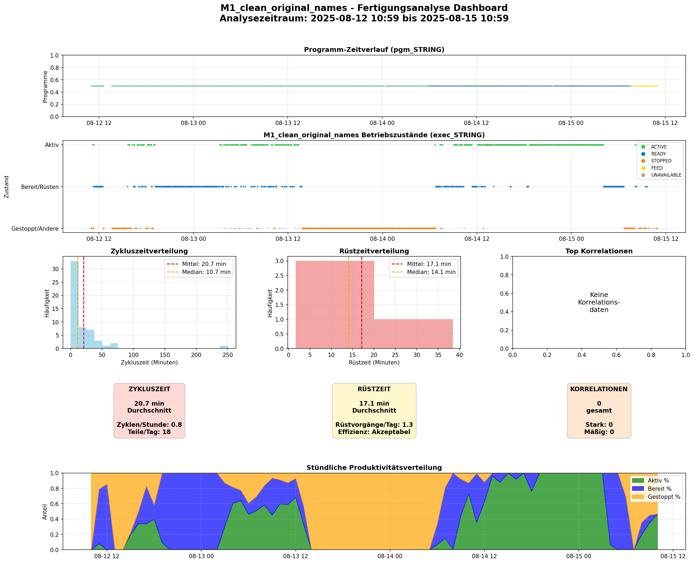

#  Data & Exploratory Data Analysis (EDA)

**Phase 1: Initiale Datenuntersuchung und Explorative Analyse**

Dieser Ordner enthält die **erste Phase** des Industrial Signal Processing & Time Series Analysis Projekts: die explorative Datenanalyse (EDA) zur Untersuchung der CNC-Maschinendaten und zur Vorbereitung der weiteren Forschung.

---

##  Projektziel dieser Phase

Diese Phase dient der **initialen Datenuntersuchung**, um:
1.  Die Datenstruktur und -qualität zu verstehen
2.  Geschäftslogik für CNC-Maschinen zu definieren
3.  Forschungsfragen zu identifizieren und zu beantworten
4.  Einen **Projektplan** für die nächste Phase zu entwickeln

**📍 Nächste Phase:** Die Erkenntnisse aus dieser EDA fließen in die Projektplanung ein, die im Ordner `/research_and_project_scope` dokumentiert wird.

---

## 📁 Ordnerstruktur

```
data_and_eda/
│
├── README.md                                          # Diese Datei
│
├──  ROHDATEN
│   ├── M1_clean_original_names.xlsx                  # CNC Maschine 1 - Originaldaten
│   └── [weitere Maschinendaten...]                   # Weitere CNC-Maschinen
│
├──  JUPYTER NOTEBOOKS (EDA)
│   ├── eda_cnc_einzelmaschinen_analyse_universal_DE.ipynb  # Universelles Analyse-Template
│   └── Data_profile_CNC_1_1508.html                  # Automatisierter EDA-Bericht
│
├──  EXPORTIERTE ANALYSEN
│   ├── dashboard_M1_*.png                            # Grafana-Style Dashboards
│   ├── signifikante_korrelations_heatmap.png         # Korrelationsmatrizen
│   └── [automatisch generierte Berichte]             # JSON, TXT, CSV Reports
│
└──  DOKUMENTATION
    └── README.md                                      # Projektdokumentation
```

---

##  Durchgeführte Analysen

###  Analyse-Dashboard Beispiel



*Grafana-Style Dashboard mit 7 Visualisierungskomponenten: Programm-Timeline, Betriebszustände, Zykluszeitverteilung, Rüstzeitverteilung, Top-Korrelationen, KPI-Karten und stündliche Produktivitätsverteilung.*

---

### 1. **Automatisierte Einzelmaschinen-Analyse**
**Notebook:** `eda_cnc_einzelmaschinen_analyse_universal_DE.ipynb`

**Zweck:** Universelles Template zur Analyse einer einzelnen CNC-Maschine mit automatisierter Berichtserstellung.

**Analysierte Forschungsfragen:**
1.  **Zykluszeit-Analyse** - "Wie lange dauert eine Zykluszeit?"
   - Durchschnittliche Zykluszeit pro Programm
   - Konsistenz der Zykluszeiten (Variationskoeffizient)
   - Produktionsrate (Zyklen/Stunde, Teile/Tag)

2.  **Rüstzeit-Analyse** - "Wie lange dauern Rüstvorgänge?"
   - Durchschnittliche Rüstzeit bei Programmwechseln
   - Rüsthäufigkeit pro Tag/Woche
   - Effizienz-Bewertung (SMED-Prinzipien)

3.  **Variablenabhängigkeits-Analyse** - "Welche Zusammenhänge existieren?"
   - Korrelationsanalyse von Prozessvariablen
   - Statistische Signifikanz (p-Werte)
   - Identifikation von Sensor-Dependencies

**Geschäftslogik:**
- **Zykluszeit:** `exec="ACTIVE"` Perioden mit Programmkontext
- **Rüstzeit:** `exec="READY"/"FEED"` mit Programmwechseln
- **Pause-Schwellenwert:** 300 Sekunden (5 Minuten) zur Zykluserkennung

**Output:**
-  Automatisierter Geschäftsbericht mit Bewertungssystem
-  Grafana-Style Dashboard mit 7 Visualisierungen
-  JSON/TXT/CSV Exports für weitere Verarbeitung
-  Handlungsempfehlungen für Produktionsteam

---

### 2. **Automatisiertes Data Profiling**
**Tool:** `ydata-profiling` (ehemals pandas-profiling)

**Output:** `Data_profile_CNC_1_1508.html`

**Enthält:**
- Univariate Statistiken aller Variablen
- Korrelationsmatrizen
- Fehlende Werte-Analyse
- Datentyp-Validierung
- Verteilungs-Visualisierungen

---

##  Datenstruktur

### Maschinendaten-Format (Excel/CSV)

**Wichtige Spalten:**
```
time               → Zeitstempel (Nanosekunden)
exec_STRING        → Maschinenstatus (ACTIVE, READY, STOPPED, FEED)
pgm_STRING         → Programmname
mode_STRING        → Betriebsmodus
ctime_REAL         → Zykluszeit (Sekunden)
[weitere Sensoren] → Zusätzliche numerische Prozessvariablen
```

**Beispiel-Dataset:**
- **Maschine:** M1_clean_original_names.xlsx
- **Zeitraum:** ~24 Stunden kontinuierliche Aufzeichnung
- **Datenpunkte:** ~15,000 Einträge
- **Sensoren:** 7 Variablen (5 STRING, 2 numerisch)

---

## 🛠️ Verwendung des Analyse-Templates

### Quick Start:

1. **Konfiguration anpassen** (Zelle 2):
```python
MACHINE_DATA_PATH = '/pfad/zu/ihrer/maschinendaten.xlsx'
MACHINE_NAME = None  # Automatisch aus Dateiname
MIN_CYCLE_DURATION = 0.1  # Minuten
MAX_CYCLE_DURATION = 480  # Minuten
```

2. **Alle Zellen ausführen** → Automatische Analyse

3. **Ergebnisse erhalten:**
   -  Dashboard (PNG)
   -  Geschäftsbericht (JSON/TXT)
   -  Metriken (CSV)

### Analyseparameter (anpassbar):

| Parameter | Standard | Bedeutung |
|-----------|----------|-----------|
| `MIN_CYCLE_DURATION` | 0.1 min | Minimale Zykluszeit |
| `MAX_CYCLE_DURATION` | 480 min | Maximale Zykluszeit (8h) |
| `MIN_SETUP_DURATION` | 0.5 min | Minimale Rüstzeit |
| `MAX_SETUP_DURATION` | 480 min | Maximale Rüstzeit |
| **Pause-Schwelle** | 300 sec | Zyklus-Trennungs-Schwellenwert |

---

## 📈 Bewertungssystem

Das Template bewertet automatisch die Maschinenleistung:

### Zykluszeit-Konsistenz (CV):
- ✅ **Exzellent:** CV < 0.2 (sehr konsistent)
- 🟢 **Gut:** CV < 0.4
- 🟡 **Mäßig:** CV < 0.6
- 🔴 **Schlecht:** CV ≥ 0.6 (inkonsistent)

### Rüstzeit-Effizienz:
- ✅ **Exzellent:** < 5 Minuten (SMED Weltklasse)
- 🟢 **Gut:** < 15 Minuten
- 🟡 **Akzeptabel:** < 30 Minuten
- 🟠 **Verbesserungsbedürftig:** < 60 Minuten
- 🔴 **Schlecht:** ≥ 60 Minuten

### Gesamtbewertung:
- **Score:** 0-30 Punkte (Zyklus: 10, Rüstzeit: 10, Korrelation: 10)
- **Rating:** EXZELLENT (≥80%) | GUT (≥60%) | VERBESSERUNGSBEDÜRFTIG (≥40%) | KRITISCH (<40%)

---

##  Wichtige Erkenntnisse aus dieser Phase

###  Was funktioniert gut:
1. **Automatisierte Analyse** von CNC-Maschinendaten
2. **Geschäftslogik** für Zyklen- und Rüstzeiterkennung
3. **Universelles Template** für beliebige CNC-Maschinen
4. **Dashboard-Visualisierung** mit 7 Komponenten

###  Einschränkungen identifiziert:
1. **Korrelationsanalyse** benötigt ≥2 numerische Sensoren
2. **Status-basierte Daten** (STRING) nicht für Korrelation nutzbar
3. **Minimale Programmdiversität** erforderlich für Rüstzeitanalyse

###  Handlungsempfehlungen für nächste Phase:
1.  **Erweiterte Sensorintegration** prüfen
2.  **Multi-Maschinen-Vergleich** implementieren
3.  **Predictive Maintenance** Modelle entwickeln
4.  **Real-Time Monitoring** Konzept erarbeiten

---

##  Nächste Schritte → Phase 2

Die Erkenntnisse aus dieser explorativen Analyse bilden die Grundlage für:

** `/research_and_project_scope/`**
-  Detaillierte Projektplanung
-  Forschungsziele und -methoden
-  Datenmodellierungs-Strategie
-  Machine Learning Architektur
- ⏱ Time Series Analysis Konzepte
-  Implementation Roadmap

**Geplante Forschungsbereiche:**
1. **Predictive Maintenance** - Vorhersage von Ausfällen
2. **Anomaly Detection** - Erkennung abnormaler Betriebszustände
3. **Time Series Forecasting** - Produktionsplanung
4. **Multi-Variate Analysis** - Sensor-Fusion und Feature Engineering
5. **Real-Time Monitoring** - Live-Dashboard und Alerting

---

## 🔧 Technische Details

### Verwendete Bibliotheken:
```python
pandas>=2.0.0              # Datenverarbeitung
numpy>=1.24.0              # Numerische Berechnungen
matplotlib>=3.7.0          # Visualisierung
seaborn>=0.12.0            # Statistische Plots
scipy>=1.10.0              # Statistische Tests
ydata-profiling>=4.0.0     # Automatisches Profiling
openpyxl>=3.1.0            # Excel-Support
```

### Jupyter Notebook Anforderungen:
- **Python:** ≥3.9
- **Jupyter:** Lab oder Notebook
- **RAM:** ≥8GB empfohlen
- **Speicher:** ~500MB für Daten + Reports

---

##  Datenqualität & Validierung

### Qualitätsprüfungen im Template:
-  Zeitstempel-Validierung
-  Fehlende Werte-Erkennung
-  Ausreißer-Entfernung (IQR-Methode)
-  Statistische Signifikanztests (p < 0.05)
-  Mindest-Sample-Size Prüfung (n ≥ 100)

### Daten-Anonymisierung:
-  Keine personenbezogenen Daten
-  Maschinennamen aus Dateinamen extrahiert
-  Nur Prozessdaten, keine Firmendaten

---

##  Projektteam & Kontakt

**Datenanalyst:** [Ihr Name]  
**Projekt:** Industrial Signal Processing & Time Series Analysis  
**Institution:** [Ihre Institution]  
**Zeitraum:** Phase 1 - EDA (Abgeschlossen)

---

##  Weiterführende Ressourcen

**Geschäftslogik-Referenzen:**
- SMED (Single-Minute Exchange of Die) Prinzipien
- Lean Manufacturing Best Practices
- OEE (Overall Equipment Effectiveness) Standards

**Statistische Methoden:**
- Pearson Korrelationsanalyse
- P-Wert Interpretation (α = 0.05)
- Variationskoeffizient (CV) als Konsistenzmaß
- IQR (Interquartile Range) für Ausreißer-Entfernung

---

##  Versionierung

| Version | Datum | Beschreibung |
|---------|-------|--------------|
| 1.0 | 2025-08-18 | Initiale EDA mit universellem Template |
| 1.1 | 2025-08-19 | Dashboard-Visualisierung hinzugefügt |
| 1.2 | 2025-01-10 | Fehlerbehandlung für fehlende Sensordaten |

---

**Status:** ✅ Phase 1 abgeschlossen  
**Nächste Phase:**  `/research_and_project_scope/` (In Entwicklung)

---

*Erstellt mit ❤️ für datengetriebene Fertigungsoptimierung*