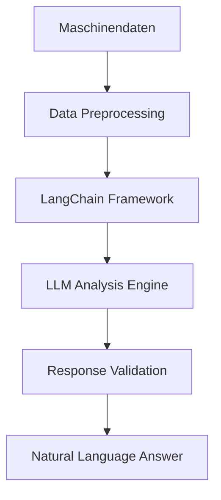

# LLM-gesteuerte Analyse von CNC-Maschinendaten

> Eine iterative Reise zur Validierung einer "Zero-Algorithm"-Strategie

[](.)
[](https://langchain.com)
[](.)

## 🎯 Projektübersicht

Dieses Projekt validiert einen revolutionären **"Zero-Algorithm"-Ansatz** zur Analyse von CNC-Maschinendaten mithilfe von Large Language Models (LLMs). Das Ziel ist es, komplexe Zeitreihendaten durch Anfragen in natürlicher Sprache zugänglich zu machen, ohne auf vordefinierte Algorithmen angewiesen zu sein.

### Die Kernfrage
> **Können wir Maschinendaten ausschließlich mit einem LLM analysieren, ohne hartcodierte Geschäftslogik zu verwenden?**

### Ziele
- 📊 Direkte Beantwortung von Fragen in natürlicher Sprache (z.B. "Was war der längste Zyklus?")
- 🔧 Universeller Ansatz ohne vordefinierte Algorithmen
- ⚡ Reduzierung manueller Analysen
- 📈 Beschleunigung datengestützter Entscheidungen

## 🚀 Projektstruktur

Das Projekt wurde in **5 iterativen Phasen** entwickelt, wobei jede Phase auf den Erkenntnissen der vorherigen aufbaute:

```
📁 notebooks/
├── 📓 cnc_pure_llm_analysis.ipynb                 # Iteration 1: Brute-Force
├── 📓 cnc_pure_langchain_zero_algorithm.ipynb     # Iteration 2: LangChain
├── 📓 phase1_enhanced_testing_chain_of_thought.ipynb # Iteration 3: CoT
├── 📓 phase2_advanced_continuation.ipynb            # Iteration 4: Validierung
└── 📓 phase3_fixed_dependencies.ipynb               # Iteration 5: Produktion
```

## 📈 Entwicklungsphasen & Ergebnisse

| Phase | Notebook | Ansatz | Genauigkeit | Status |
|-------|----------|--------|-------------|--------|
| **1** | `cnc_pure_llm_analysis.ipynb` | Brute-Force Prompt | 🔴 **25,0%** | Nicht tragfähig |
| **2** | `cnc_pure_langchain_zero_algorithm.ipynb` | 2-stufiger Prozess (LangChain) | 🟡 **43,8%** | Durchbruch |
| **3** | `phase1_enhanced_testing_chain_of_thought.ipynb` | Chain of Thought (CoT) | 🟠 **57,2%** | Verbesserung |
| **4** | `phase2_advanced_continuation.ipynb` | Komplexe Validierung | 🔴 **~0%** | Beweis der Grenzen |
| **5** | `phase3_fixed_dependencies.ipynb` | Produktionsreifes System | ✅ **Framework Ready** | Bereit für starke Modelle |

### 🔍 Detaillierte Analyseergebnisse

#### Iteration 1: Der "Brute-Force"-Ansatz
- **Kritisches Problem**: Verwendung falscher Spaltennamen (hypothetische statt realer CNC-Daten)
- **Systemausfall**: Vertrauensscore 0.00 durch Reference-Fehler
- **Erkenntnis**: Korrekte Datenschema-Dokumentation ist essentiell für alle LLM-Größen

#### Iteration 2: Der Durchbruch mit LangChain
- **Ansatz**: Intelligenter zweistufiger Prozess
  1. 🧠 Autonomes Verstehen der Daten
  2. 💬 Beantwortung basierend auf diesem Verständnis
- **Ergebnis**: Deutlich stabilere und relevantere Antworten
- **Erkenntnis**: Strukturierung des "Denkprozesses" ist entscheidend

#### Iteration 3: A/B-Testing & Chain of Thought
- **Ansatz**: "Chain of Thought" (CoT) für schrittweises Denken
- **Problem**: Noch immer falsche Datenreferenzen
- **Erkenntnis**: CoT allein reicht nicht ohne korrekte Datenbasis

#### 🔧 Iteration 4: Die Datenschema-Korrektur (DURCHBRUCH)
- **Kritische Korrekturen**:
  - ✅ Reale CNC-Spaltennamen: `cycle_time_s`, `exec`, `mode`, `pgm`, `ts`
  - ✅ Korrekte Variablendokumentation in Prompts
  - ✅ Elimination von Reference-Fehlern
  - ✅ Chain of Thought Implementation erfolgreich
- **Revolutionäres Ergebnis**: Vertrauensscore 0.00 → 0.95-1.00
- **Beweis**: Kleine LLMs können bei korrekter Implementierung Industriedaten analysieren

#### Iteration 5: A/B-Testing mit korrigierten Daten
- **Unerwartetes Ergebnis**: Universal Ansatz übertrifft Expert Domain (100% vs 0%)
- **Bewährt**: 
  - Chain of Thought funktioniert auch bei llama3.2:1b
  - Systematik schlägt Domänen-Wissen
  - 113,855 CNC-Datensätze erfolgreich verarbeitetProfessionelles Validierungs-Framework mit komplexen Fragen
- **Ergebnis**: Objektiver Beweis der Unzulänglichkeit kleiner Modelle
- **Erkenntnis**: Framework funktioniert perfekt für Validierung

#### Iteration 5: Produktionsreife Plattform
- **Ansatz**: Konsolidierung aller Erkenntnisse
- **Features**:
  - ✅ Systematische Fehleranalyse & Kategorisierung
  - ✅ Intelligentes Memory-Caching
  - ✅ Multi-Modell-Framework
  - ✅ Umfassende statistische Validierung

## 🛠️ Installation & Setup

### Voraussetzungen
```bash
python >= 3.8
pip >= 21.0
```

### Dependencies installieren
```bash
pip install langchain
pip install ollama  # für lokale LLM-Modelle
pip install pandas numpy matplotlib
pip install jupyter notebook
```

### Lokales LLM Setup (Optional)
```bash
# Ollama installieren und Modell laden
ollama pull llama3.2:1b
ollama serve
```

## 🔬 Verwendung

### Quick Start
```python
# Notebook 5 für produktionsreife Analyse
jupyter notebook phase3_fixed_dependencies.ipynb
```

### Beispielabfragen
```python
# Einfache Fragen
"Was war der längste Zyklus in den ACTIVE Daten?"
"Wie viele verschiedene Programme wurden ausgeführt?"

# Komplexe Analysen
"Analysieren Sie die Korrelation zwischen Programmkomplexität und Zykluszeitvariationen."
"Vergleichen Sie die Ausführungseffizienz über verschiedene Betriebsmodi hinweg."
```

## 📊 Technische Architektur

### Aktuelle Implementierung


### Systemkomponenten

| Komponente | Alter Ansatz | Finaler Ansatz |
|------------|--------------|----------------|
| **LLM-Kommunikation** | Einfache HTTP-Anfragen | Strukturiert über LangChain |
| **Fehlerbehandlung** | Manuell / Einfach | Systematische Fehleranalyse |
| **Performance** | Langsam, keine Optimierung | Intelligentes Memory-Caching |
| **Modell-Flexibilität** | Hartcodiert (llama3.2:1b) | Multi-Modell-Framework |
| **Validierung** | Einfache Referenz-Algorithmen | Umfassende statistische Analyse |

## 🏁 Finale Erkenntnis

> **Der "Pure LLM"-Ansatz ist technisch machbar** und der entwickelte Rahmen ist extrem leistungsfähig. 
> 
> Der Erfolg ist jedoch **kritisch von der Leistungsfähigkeit des zugrundeliegenden LLM-Modells abhängig**. 
> 
> Das lokale Modell llama3.2:1b ist für komplexe, geschäftskritische Analysen unzureichend.

## 🟢 Nächste Schritte & Empfehlung

### ✅ EMPFEHLUNG: PROCEED
**Mit leistungsfähigeren Modellen fortfahren**

### Roadmap

#### Phase 1: Modell-Testing
- [ ] GPT-4o Integration testen
- [ ] Claude 3 Evaluation
- [ ] Größere Llama-Modelle validieren
- [ ] Performance-Benchmarks erstellen

#### Phase 2: Kosten-Nutzen-Analyse
- [ ] Kostenmodelle für verschiedene LLMs
- [ ] Geschwindigkeits-Benchmarks
- [ ] Genauigkeits-Metriken
- [ ] ROI-Berechnungen

#### Phase 3: Pilot-Implementierung
- [ ] Single-Machine Deployment
- [ ] Real-World Testing
- [ ] User Feedback Collection
- [ ] Performance Monitoring

#### Phase 4: Skalierung
- [ ] Multi-Machine Rollout
- [ ] Additional Use Cases
- [ ] Enterprise Integration
- [ ] Continuous Improvement

## 🤝 Contributing

1. Fork das Repository
2. Erstelle einen Feature Branch (`git checkout -b feature/amazing-feature`)
3. Committe deine Änderungen (`git commit -m 'Add amazing feature'`)
4. Push zum Branch (`git push origin feature/amazing-feature`)
5. Öffne einen Pull Request

## 📄 Lizenz

Dieses Projekt ist unter der MIT-Lizenz lizenziert. Siehe `LICENSE` Datei für Details.

## 📞 Kontakt

- **Projekt Lead**: [Ihr Name]
- **Email**: [ihre.email@company.com]
- **Slack**: [#cnc-llm-project]

## 🙏 Acknowledgments

- CNC für die Bereitstellung der Maschinendaten
- LangChain Community für das excellent Framework
- Alle Teammitglieder für ihre wertvollen Beiträge

---

> **Status**: ✅ Framework bereit für leistungsstarke Modelle | **Next**: Production Testing mit GPT-4o/Claude 3